# Architekturüberblick

## Moduldiagramm

```mermaid
flowchart TD
    Main[source/main.cpp\nApp-Orchestrator]
    MenuCtrl[source/menu/controllers/main_menu_controller.*\nMenü-Logik + Actions]
    MenuView[source/menu/views/main_menu_view.*\nMenü-Rendering]
    Manual[source/menu/views/manual_content.*\nHandbuchdaten]
    GameplayCore[source/gameplay/gameplay_scene.cpp\nUpdate/Render-Orchestrierung]
    GameplayInput[source/gameplay/gameplay_scene_input.cpp\nInput + UI-Interaktion]
    GameplayPersist[source/gameplay/gameplay_scene_persistence.cpp\nSave/Load/Fog-of-War]
    BottomUI[source/gameplay/render/bottom_ui*.cpp\nBottom-Screen Tabs]
    TileRender[source/gameplay/render/tile_renderer.*\nTile/Karten-Rendering]
    Core[source/core/game_core.*\nGameplay-Kern]
    World[source/core/world_map.*\nWelt/Raumstruktur]
    Settings[source/core/app_settings.*\nPersistente App-Settings]
    Text[source/ui/text_renderer.*\nTextausgabe]

    Main --> MenuCtrl
    Main --> MenuView
    Main --> GameplayCore
    Main --> Settings

    MenuCtrl --> Main
    MenuView --> Manual
    MenuView --> Text

    GameplayCore --> GameplayInput
    GameplayCore --> GameplayPersist
    GameplayCore --> BottomUI
    GameplayCore --> TileRender
    GameplayCore --> Core
    GameplayCore --> World
    GameplayCore --> Settings
    GameplayCore --> Text
```

## Modulstruktur
- `source/main.cpp`
  - App-Loop, State-Wechsel (`APP_MAIN_MENU` / `APP_GAME`), Render-Frame.
- `source/menu/controllers/main_menu_controller.*`
  - Menü-Zustandsmaschine + Input-Verarbeitung + Action-Dispatch.
- `source/menu/views/*`
  - Reine Darstellung des Hauptmenüs.
  - `manual_content.*` enthält Handbuchdaten getrennt von Renderlogik.
- `source/gameplay/gameplay_scene.*`
  - High-Level Gameplay-Orchestrierung: Input, Update, Persistenz, Render-Delegation.
- `source/core/game_core.*`
  - Kern-Gameplay-Mechanik (Physik/Kollision/Spieler).
- `source/core/world_map.*`
  - Welt-/Raumstruktur und Spatial-Map.
- `source/gameplay/render/*`
  - Bottom-UI und Tile-Rendering.
- `source/core/app_settings.*`
  - Persistente Settings auf SD.

## Designprinzip aktuell
- Controller und View sind getrennt.
- Gameplay-Logik ist vom Menü getrennt.
- Persistenz liegt im Gameplay/Settings-Bereich, nicht in UI-Code.

## Wichtige Kopplungen
- `main.cpp` verbindet Menüaktionen mit Gameplay-Methoden.
- `MainMenuController` kennt keine Speicherdetails, nur abstrakte Aktionen.
- `GameplayScene` kapselt Save/Fog-of-War pro Slot.
