# Game-Architektur

## Moduldiagramm

```mermaid
flowchart TD
    Main[3ds-cpp/source/main.cpp\nApp-Orchestrator]
    MenuCtrl[3ds-cpp/source/menu/controllers/main_menu_controller.*\nMenü-Logik + Actions]
    MenuLayout[3ds-cpp/source/menu/main_menu_layout.h\nGemeinsame Touch-/Layout-Konstanten]
    MenuView[3ds-cpp/source/menu/views/main_menu_view.*\nMenü-Rendering]
    Manual[3ds-cpp/source/menu/views/manual_content.*\nHandbuchdaten]
    GameplayCore[3ds-cpp/source/gameplay/gameplay_scene.cpp\nInit/Render/Basiszustand]
    GameplayInput[3ds-cpp/source/gameplay/gameplay_scene_input.cpp\nInput + UI-Interaktion]
    GameplayPersist[3ds-cpp/source/gameplay/gameplay_scene_persistence.cpp\nSave/Load/Fog-of-War]
    GameplayRuntime[3ds-cpp/source/gameplay/gameplay_scene_runtime.cpp\nFrame-Update-Orchestrierung]
    GameplayTransition[3ds-cpp/source/gameplay/gameplay_scene_transition.cpp\nRaumwechsel + Respawn]
    GameplayItems[3ds-cpp/source/gameplay/gameplay_scene_items.cpp\nMap-Items + Pickup-Effekte]
    PlayerLogic[3ds-cpp/source/gameplay/player/player_logic.*\nSpielerbewegung + Kollision]
    JumpLogic[3ds-cpp/source/gameplay/player/jump_logic.*\nSprungverhalten + Coyote-Time]
    MovementInput[3ds-cpp/source/gameplay/player/movement_input.*\nInput nach Geschwindigkeit]
    CollisionLogic[3ds-cpp/source/gameplay/player/collision_logic.*\nX/Y-Kollisionen]
    DangerLogic[3ds-cpp/source/gameplay/player/danger_logic.*\nGefahrenkachelpruefung]
    BottomUI[3ds-cpp/source/gameplay/render/bottom_ui*.cpp\nBottom-Screen Tabs]
    TileRender[3ds-cpp/source/gameplay/render/tile_renderer.*\nTile/Karten-Rendering]
    Core[3ds-cpp/source/core/game_core.*\nGameplay-Kern]
    TileMapIO[3ds-cpp/source/core/tile_map_io.cpp\nTileMap Laden/JSON-Parsing]
    World[3ds-cpp/source/core/world_map.*\nWelt/Raumstruktur]
    Settings[3ds-cpp/source/core/app_settings.*\nPersistente App-Settings]
    Text[3ds-cpp/source/ui/text_renderer.*\nTextausgabe]

    Main --> MenuCtrl
    Main --> MenuView
    Main --> GameplayCore
    Main --> Settings

    MenuCtrl --> Main
    MenuCtrl --> MenuLayout
    MenuView --> MenuLayout
    MenuView --> Manual
    MenuView --> Text

    GameplayCore --> GameplayInput
    GameplayCore --> GameplayPersist
    GameplayCore --> GameplayRuntime
    GameplayCore --> GameplayTransition
    GameplayCore --> GameplayItems
    GameplayCore --> PlayerLogic
    PlayerLogic --> JumpLogic
    PlayerLogic --> MovementInput
    PlayerLogic --> CollisionLogic
    PlayerLogic --> DangerLogic
    GameplayCore --> BottomUI
    GameplayCore --> TileRender
    GameplayCore --> Core
    Core --> TileMapIO
    GameplayCore --> World
    GameplayCore --> Settings
    GameplayCore --> Text
```

## Modulstruktur
- `3ds-cpp/source/main.cpp`
  - App-Loop, State-Wechsel (`APP_MAIN_MENU` / `APP_GAME`), Render-Frame.
- `3ds-cpp/source/menu/controllers/main_menu_controller.*`
  - Menü-Zustandsmaschine + Input-Verarbeitung + Action-Dispatch.
- `3ds-cpp/source/menu/main_menu_layout.h`
  - Gemeinsame Layout- und Touchzonen-Konstanten für Controller und View.
- `3ds-cpp/source/menu/views/*`
  - Reine Darstellung des Hauptmenüs.
  - `manual_content.*` enthält Handbuchdaten getrennt von Renderlogik.
- `3ds-cpp/source/gameplay/gameplay_scene.*`
  - Basisklasse fuer Init, Render und gemeinsam genutzten Szenenzustand.
- `3ds-cpp/source/gameplay/gameplay_scene_runtime.cpp`
  - Frame-Update-Orchestrierung (Physics-Update, Items, Transition, Runtime-Timer).
- `3ds-cpp/source/gameplay/gameplay_scene_transition.cpp`
  - Raumwechsel, Checkpoint-Respawn und Welt-/Tile-Zustand nach Kartenwechsel.
- `3ds-cpp/source/gameplay/gameplay_scene_items.cpp`
  - Item-Liste der aktuellen Karte, Pickup-Kollisionen und UI-Meldungen.
- `3ds-cpp/source/core/game_core.*`
  - Kern-Gameplay-Fassade (Map-Laden, Spawn/Respawn, Delegation an Player-Logik).
- `3ds-cpp/source/core/tile_map_io.cpp`
  - Text-/JSON-Lader für `TileMap` inkl. Item-Extraktion und Platzhalterkonvertierung.
- `3ds-cpp/source/gameplay/player/player_logic.*`
  - Framebasierte Orchestrierung der einzelnen Player-Submodule.
- `3ds-cpp/source/gameplay/player/jump_logic.*`
  - Sprungsystem mit Bodensprung, Coyote-Time, Doppelsprung und variablem Sprung-Cut.
- `3ds-cpp/source/gameplay/player/movement_input.*`
  - Uebersetzung von Richtungsinput in horizontale Geschwindigkeit.
- `3ds-cpp/source/gameplay/player/collision_logic.*`
  - Seitliche/vertikale Kollisionsaufloesung und Schraegkachel-Interaktion.
- `3ds-cpp/source/gameplay/player/danger_logic.*`
  - Separates Pruefmodul fuer Gefahrenkacheln (Tod-Detektion).
- `3ds-cpp/source/core/world_map.*`
  - Welt-/Raumstruktur und Spatial-Map.
- `3ds-cpp/source/gameplay/render/*`
  - Bottom-UI und Tile-Rendering.
- `3ds-cpp/source/core/app_settings.*`
  - Persistente Settings auf SD.

## Designprinzip aktuell
- Controller und View sind getrennt.
- Gameplay-Logik ist vom Menü getrennt.
- Persistenz liegt im Gameplay/Settings-Bereich, nicht in UI-Code.
- Player-bezogene Mechaniken sind in Untermodulen aufgeteilt; `GameCore` bleibt schlank.
- `GameplayScene` ist in Runtime-, Item- und Transition-Module geteilt; Zustand und Rendering bleiben zentral.
- Erweiterungen wie das Item-/Inventarsystem sind als eigene Module unter
  `gameplay/items` gekapselt und kommunizieren über bitweise Flags, sodass
  neue Effekte leicht hinzufügbar sind.
- Beim Raumwechsel werden Spawnkoordinaten geclamped, um Abstürze in sehr
  schmalen oder niedrigen Räumen (z.B. SafeRoom) zu vermeiden.

## Verwandte Dokus (Obsidian)
- [[docs/GESAMTDOKU|Gesamtdokumentation (Hub)]]
- [[docs/game/README|Game Überblick]]
- [[docs/game/PLAYER_LOGIK|Player- und Sprunglogik]]
- [[docs/game/RUNTIME_FLOW|Game-Laufzeitfluss]]
- [[docs/game/SAVE_AND_SETTINGS|Save-, Slot- und Settings-System]]
- [[docs/workspace/ARCHITEKTUR_UEBERSICHT|Gesamtarchitektur]]
